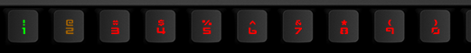

# Q Applet: Pomodoro Max

Stay productive with a fully customizable work/break timer inspired by the Pomodoro technique, running right on your Das Keyboard Q.
The applet gradually colors a bar of keys to visualize time passing, with color-coded lighting indicating whether it’s focus time or break time.

## ⏱ Applet Behavior

- User chooses two colors: one for work and one for break
- A bar fills progressively to show the cycle’s progress
- Automatically alternates between work and break periods
- Keeps time between polls, your cycle won’t reset or drift

## ⚙️ Setup Instructions

1. **Install this applet** in the Das Keyboard Q software
2. **Assign the applet to any bar of keys** on your keyboard
3. **Configure your preferred durations and colors**
4. **Watch the key light up** based on whether it's time to work or time to take a break!

## Example

Pomodoro Max counting on the number keys.

## Changelog

[CHANGELOG.MD](CHANGELOG.md)

## Installation

Requires a Das Keyboard Q series: www.daskeyboard.com

Installation, configuration and uninstallation of applets is done within
the Q Desktop application (<https://www.daskeyboard.com/q>)

## Running tests

    yarn test

## Contributions

Pull requests welcome.
